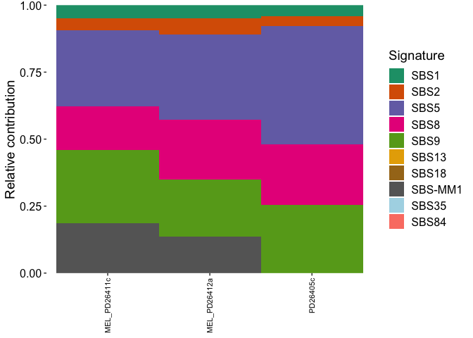

<!-- README.md is generated from README.Rmd. Please edit that file -->

# mmsig

<!-- badges: start -->
<!-- badges: end -->

The goal of mmsig is to provide a flexible and easily interpretable
mutational signature analysis tool. mmsig was developed for
hematological malignancies, but can be extended to any cancer with a
well-known mutational signature landscape.

mmsig is based on an expectation maximization algorithm for mutational
signature fitting and applies cosine similarities for dynamic error
suppression as well as bootstrapping-based confidence intervals and
assessment of transcriptional strand bias.

Citation: Rustad, E.H., Nadeu, F., Angelopoulos, N. et al. mmsig: a
fitting approach to accurately identify somatic mutational signatures in
hematological malignancies. Commun Biol 4, 424 (2021).
<https://doi.org/10.1038/s42003-021-01938-0>

## Package Update

mmsig can now fully accommodate GRCh38 aligned data with both COSMIC
v3.1 and v3.2 signatures.

All original code and documents for the mmsig R package were developed
by [Even Rustad](https://github.com/evenrus/mmsig) and the updates
outlined in this README were incorporated by [Patrick
Blaney](https://github.com/pblaney/mmsig)

## Installation

You can install the development version with:

``` r
# install.packages("devtools")
devtools::install_github(repo = "pblaney/mmsig")

library(mmsig)
```

# Example - hg19 Data

This is a basic example which shows mmsig usage for hg19 aligned data
and COSMIC v3.1 mutational signatures.

### Load in data

``` r
# SNV data in simple format of: sample, chromosome, position, reference, alternate

data(mm_5_col)

# Subset of hg19 derived COSMIC v3.1 mutational signatures as outlined in publication
# SBS1, SBS2, SBS5, SBS8, SBS9, SBS13, SBS18, SBS35, SBS84, SBS-MM1

data(signature_ref)
```

### Subset Mutation Data and Signature Reference

``` r
# remove canonical AID (SBS84) for genome-wide analysis
# remove the platinum signature (SBS35) because the patients are not platinum exposed

sig_ref <- signature_ref[c("sub", "tri", "SBS1", "SBS2", "SBS5", "SBS8", 
                           "SBS9", "SBS13", "SBS18", "SBS-MM1")]

# subset three samples to reduce run time

mm_5_col_subset <- mm_5_col[mm_5_col$sample %in% c("MEL_PD26412a",
                                                   "MEL_PD26411c",
                                                   "PD26405c"),]
```

### Perform Mutational Signature Analysis

``` r
# Bootstrapping large datasets with many iterations can significantly increase runtime.

set.seed(1)
sig_out <- mm_fit_signatures(muts.input = mm_5_col_subset, 
                             sig.input = sig_ref,
                             input.format = "vcf",
                             sample.sigt.profs = NULL, 
                             strandbias = TRUE,
                             bootstrap = TRUE,
                             iterations = 100,
                             genome = "hg19",
                             refcheck = TRUE,
                             cos_sim_threshold = 0.01,
                             force_include = c("SBS1", "SBS5"),
                             dbg = FALSE)
```

### Plot Signature Estimates

``` r
# Generate a stacked bar graph of the relative contribution of each signature in each sample

plot_signatures(sig = sig_out$estimate, 
                samples = T, 
                sig_order = c("SBS1", "SBS2", "SBS13", "SBS5", "SBS8", "SBS9", 
                              "SBS18", "SBS-MM1", "SBS35"))
```



### Plot Bootstrapped Confidence Intervals for Signature Estimates

``` r
# Generate a side-by-side bar graph of each signatures contribution with
# bootstrapped CIs for each sample

bootSigsPlot(mutSigsSummary = sig_out$bootstrap)
```


### Transcriptional Strand Bias Evaluation for SBS-MM1

``` r
head(sig_out$strand_bias_mm1)
#>          group transcribed untranscribed     ratio     p_poisson MM1_flag
#> 1 MEL_PD26411c         192           119 1.6134454 0.00004127438        *
#> 2 MEL_PD26412a         193           148 1.3040541 0.01705720483        *
#> 3     PD26405c          60            67 0.8955224 0.59461548594
```

# Example - hg38 Data

This is a basic example which shows mmsig usage for hg38 aligned data
and COSMIC v3.1 mutational signatures.

The data used in this example was generated from the same samples using
the [MGP1000 pipeline](https://github.com/pblaney/mgp1000) which aligned
and called against hg38.

Important Note: For this example, the melphalan signature SBS-MM1 was
added from the original signature reference data. There is no current
version of this signature for hg38, yet.

See [wiki](https://github.com/pblaney/mmsig/wiki) for how the new
signature reference data was generated.

### Load in data

``` r
# SNV data in simple format of: sample, chromosome, position, reference, alternate

data(mm_5_col_hg38)

# Subset of hg38 derived COSMIC v3.1 mutational signatures as outlined in publication
# SBS1, SBS2, SBS5, SBS8, SBS9, SBS13, SBS18, SBS35, SBS84, SBS-MM1

data(signature_ref_cosmic_v3_1_hg38)
```

### Subset Signature Reference

``` r
# remove canonical AID (SBS84) for genome-wide analysis
# remove the platinum signature (SBS35) because the patients are not platinum exposed

sig_ref_cosmic_v3_1_hg38 <- signature_ref_cosmic_v3_1_hg38[c("sub", "tri", "SBS1", "SBS2", "SBS5",
                                                             "SBS8", "SBS9", "SBS13", "SBS18", "SBS-MM1")]

# Mutation data is already subset to same 3 samples as hg19 example
```

### Perform Mutational Signature Analysis

``` r
# Bootstrapping large datasets with many iterations can significantly increase runtime.

set.seed(1)
sig_out_cosmic_v3_1_hg38 <- mm_fit_signatures(muts.input = mm_5_col_hg38,
                                              sig.input = sig_ref_cosmic_v3_1_hg38,
                                              input.format = "vcf",
                                              sample.sigt.profs = NULL,
                                              strandbias = TRUE,
                                              bootstrap = TRUE,
                                              iterations = 200,
                                              genome = "hg38",
                                              refcheck = TRUE,
                                              cos_sim_threshold = 0.01,
                                              force_include = c("SBS1", "SBS5"),
                                              dbg = FALSE)
```

### Plot Signature Estimates

``` r
# Generate a stacked bar graph of the relative contribution of each signature in each sample

plot_signatures(sig = sig_out_cosmic_v3_1_hg38$estimate, 
                samples = T, 
                sig_order = c("SBS1", "SBS2", "SBS13", "SBS5", "SBS8", "SBS9", 
                              "SBS18", "SBS-MM1", "SBS35"))
```


### Plot Bootstrapped Confidence Intervals for Signature Estimates

``` r
# Generate a side-by-side bar graph of each signatures contribution with
# bootstrapped CIs for each sample

bootSigsPlot(mutSigsSummary = sig_out_cosmic_v3_1_hg38$bootstrap)
```


### Transcriptional Strand Bias Evaluation for SBS-MM1

``` r
head(sig_out_cosmic_v3_1_hg38$strand_bias_mm1)
#>          group transcribed untranscribed     ratio        p_poisson MM1_flag
#> 1     PD26405c         123           136 0.9044118 0.45594784306067         
#> 2 MEL_PD26411c         327           200 1.6350000 0.00000003498491        *
#> 3 MEL_PD26412a         315           269 1.1710037 0.06249465634500
```
